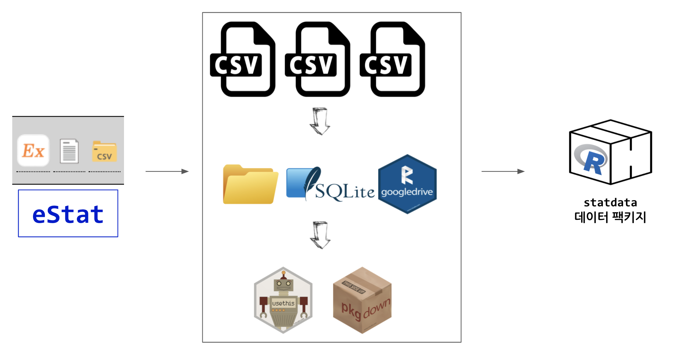

# statdata 

<!-- badges: start -->
<!-- badges: end -->

The goal of `statdata` is to consolidate educational datasets for STEM. 
This package contains the datasets shown in the Korean elementary, middle, and high schoool textbooks.

## Installation

You can install the released version of `statdata` from [GitHub repository](https://github.com/tidyverse-korea/statdata) with:

``` r
devtools::install_github("tidyverse-korea/statdata")
```

## Workflow

This package ingests `.csv` files in order to make them available with minimum efforts.
The basic workflow to turn `.csv` files into the package datasets is as follows;



